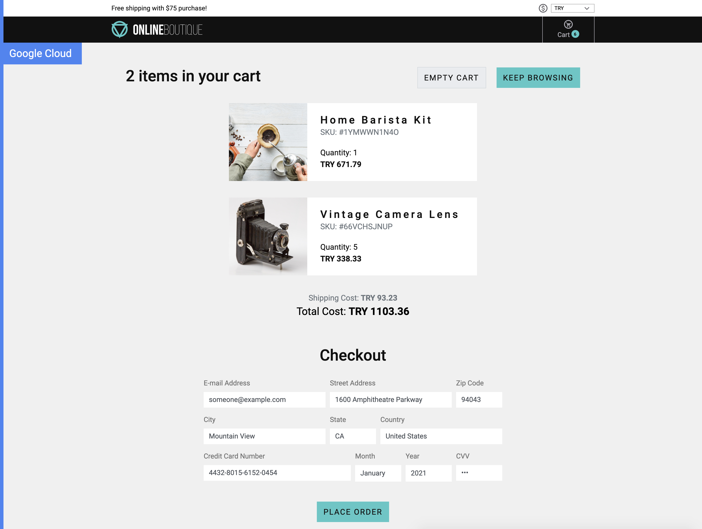
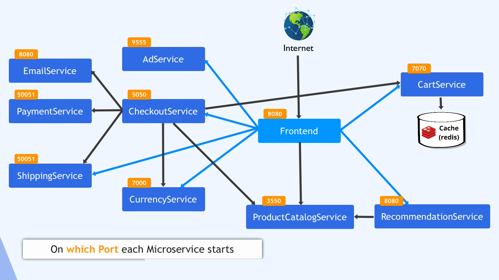

# Deploying a Microservices Application in Kubernetes

We're deploying a microservices-based **online shop application** into a Kubernetes cluster. This guide covers the process from preparing manifests to applying production best practices.


---



---

## Complete Process Workflow

This section focuses on deployment details: which microservices are involved, how they communicate, and their dependencies on third-party services or databases.

For example, some services use a message broker, others require a database. It's important to identify the entry-point microservice that handles browser requests.

### ✅ Key Steps:

- ✅ Created YAML files with **11 Deployment** and corresponding **Service manifests**
- ✅ All services are internal **except** the **Frontend Service**, which is accessible from a browser
- ✅ Created a Kubernetes cluster with **3 Worker Nodes** (e.g., on Linode or other cloud platforms)
- ✅ Connected to the cluster
- ✅ Created a **Namespace** and deployed all microservices
- ✅ Accessed the Online Shop via a browser

---

## Production & Security Best Practices

- **BP 1**: Added version to each container image  
- **BP 2**: Configured **Liveness Probes**  
- **BP 3**: Configured **Readiness Probes**  
- **BP 4**: Set **Resource Requests**  
- **BP 5**: Set **Resource Limits**  
- **BP 6**: Avoided using **NodePort** service type  
- **BP 7**: Configured **more than 1 replica** for each Deployment  

---

## List of the Microservices in the Application

The application consists of the following microservices:

- `emailservice`
- `recommendationservice`
- `paymentservice`
- `productcatalogservice`
- `currencyservice`
- `shippingservice`
- `adservice`
- `cartservice`
- `checkoutservice`
- `frontend` _(with external access)_
- `redis-cart` _(third-party service)_

---

## Microservices Connection Graph

A connection graph helps visualize how services interact.



---

## Deployment and Service Configurations

We created 11 YAML files. 1 for each deployment and its corresponding service.

```bash
vim emailservice.yaml
```

```yaml
---
apiVersion: apps/v1
kind: Deployment
metadata:
  name: emailservice
spec:
  selector:
    matchLabels:
      app: emailservice
  template:
    metadata:
      labels:
        app: emailservice
    spec:
      containers:
      - name: server
        image: gcr.io/google-samples/microservices-demo/emailservice:v0.2.3
        ports:
        - containerPort: 8080
        env:
        - name: PORT
          value: "8080"
        - name: DISABLE_TRACING
          value: "1"
        - name: DISABLE_PROFILER
          value: "1"
        readinessProbe:
          periodSeconds: 5
          exec:
            command: ["/bin/grpc_health_probe", "-addr=:8080"]
        livenessProbe:
          periodSeconds: 5
          exec:
            command: ["/bin/grpc_health_probe", "-addr=:8080"]
        resources:
          requests:
            cpu: 100m
            memory: 64Mi
          limits:
            cpu: 200m
            memory: 128Mi
---
apiVersion: v1
kind: Service
metadata:
  name: emailservice
spec:
  type: ClusterIP
  selector:
    app: emailservice
  ports:
  - protocol: TCP
    port: 5000
    targetPort: 8080
```

To apply the configuration:

```bash
kubectl apply -f emailservice.yaml
```
---

```bash
vim recommendationservice.yaml
```

```yaml
---
apiVersion: apps/v1
kind: Deployment
metadata:
  name: recommendationservice
spec:
  selector:
    matchLabels:
      app: recommendationservice
  template:
    metadata:
      labels:
        app: recommendationservice
    spec:
      containers:
      - name: server
        image: gcr.io/google-samples/microservices-demo/recommendationservice:v0.2.3
        ports:
        - containerPort: 8080
        readinessProbe:
          periodSeconds: 5
          exec:
            command: ["/bin/grpc_health_probe", "-addr=:8080"]
        livenessProbe:
          periodSeconds: 5
          exec:
            command: ["/bin/grpc_health_probe", "-addr=:8080"]
        env:
        - name: PORT
          value: "8080"
        - name: PRODUCT_CATALOG_SERVICE_ADDR
          value: "productcatalogservice:3550"
        - name: DISABLE_TRACING
          value: "1"
        - name: DISABLE_PROFILER
          value: "1"
        - name: DISABLE_DEBUGGER
          value: "1"  
        resources:
          requests:
            cpu: 100m
            memory: 220Mi
          limits:
            cpu: 200m
            memory: 450Mi
---
apiVersion: v1
kind: Service
metadata:
  name: recommendationservice
spec:
  type: ClusterIP
  selector:
    app: recommendationservice
  ports:
  - protocol: TCP
    port: 8080
    targetPort: 8080
```

To apply the configuration:

```bash
kubectl apply -f recommendationservice.yaml
```

---

```bash
vim paymentservice.yaml
```

```yaml
---
apiVersion: apps/v1
kind: Deployment
metadata:
  name: paymentservice
spec:
  selector:
    matchLabels:
      app: paymentservice
  template:
    metadata:
      labels:
        app: paymentservice
    spec:
      containers:
      - name: server
        image: gcr.io/google-samples/microservices-demo/paymentservice:v0.2.3
        ports:
        - containerPort: 50051
        env:
        - name: PORT
          value: "50051"
        readinessProbe:
          exec:
            command: ["/bin/grpc_health_probe", "-addr=:50051"]
        livenessProbe:
          exec:
            command: ["/bin/grpc_health_probe", "-addr=:50051"]
        resources:
          requests:
            cpu: 100m
            memory: 64Mi
          limits:
            cpu: 200m
            memory: 128Mi
---
apiVersion: v1
kind: Service
metadata:
  name: paymentservice
spec:
  type: ClusterIP
  selector:
    app: paymentservice
  ports:
  - protocol: TCP
    port: 50051
    targetPort: 50051
```

To apply the configuration:

```bash
kubectl apply -f paymentservice.yaml
```

---

```bash
vim productcatalogservice.yaml
```

```yaml
---
apiVersion: apps/v1
kind: Deployment
metadata:
  name: productcatalogservice
spec:
  selector:
    matchLabels:
      app: productcatalogservice
  template:
    metadata:
      labels:
        app: productcatalogservice
    spec:
      containers:
      - name: server
        image: gcr.io/google-samples/microservices-demo/productcatalogservice:v0.2.3
        ports:
        - containerPort: 3550
        env:
        - name: PORT
          value: "3550"
        readinessProbe:
          exec:
            command: ["/bin/grpc_health_probe", "-addr=:3550"]
        livenessProbe:
          exec:
            command: ["/bin/grpc_health_probe", "-addr=:3550"]
        resources:
          requests:
            cpu: 100m
            memory: 64Mi
          limits:
            cpu: 200m
            memory: 128Mi
---
apiVersion: v1
kind: Service
metadata:
  name: productcatalogservice
spec:
  type: ClusterIP
  selector:
    app: productcatalogservice
  ports:
  - protocol: TCP
    port: 3550
    targetPort: 3550
```

To apply the configuration:

```bash
kubectl apply -f productcatalogservice.yaml
```

---

```bash
vim currencyservice.yaml
```

```yaml
---
apiVersion: apps/v1
kind: Deployment
metadata:
  name: currencyservice
spec:
  selector:
    matchLabels:
      app: currencyservice
  template:
    metadata:
      labels:
        app: currencyservice
    spec:
      containers:
      - name: server
        image: gcr.io/google-samples/microservices-demo/currencyservice:v0.2.3
        ports:
        - containerPort: 7000
        env:
        - name: PORT
          value: "7000"
        readinessProbe:
          exec:
            command: ["/bin/grpc_health_probe", "-addr=:7000"]
        livenessProbe:
          exec:
            command: ["/bin/grpc_health_probe", "-addr=:7000"]
        resources:
          requests:
            cpu: 100m
            memory: 64Mi
          limits:
            cpu: 200m
            memory: 128Mi
---
apiVersion: v1
kind: Service
metadata:
  name: currencyservice
spec:
  type: ClusterIP
  selector:
    app: currencyservice
  ports:
  - protocol: TCP
    port: 7000
    targetPort: 7000
```

To apply the configuration:

```bash
kubectl apply -f currencyservice.yaml
```

---

```bash
vim shippingservice.yaml
```

```yaml
---
apiVersion: apps/v1
kind: Deployment
metadata:
  name: shippingservice
spec:
  selector:
    matchLabels:
      app: shippingservice
  template:
    metadata:
      labels:
        app: shippingservice
    spec:
      containers:
      - name: server
        image: gcr.io/google-samples/microservices-demo/shippingservice:v0.2.3
        ports:
        - containerPort: 50051
        env:
        - name: PORT
          value: "50051"
        readinessProbe:
          periodSeconds: 5
          exec:
            command: ["/bin/grpc_health_probe", "-addr=:50051"]
        livenessProbe:
          exec:
            command: ["/bin/grpc_health_probe", "-addr=:50051"]
        resources:
          requests:
            cpu: 100m
            memory: 64Mi
          limits:
            cpu: 200m
            memory: 128Mi
---
apiVersion: v1
kind: Service
metadata:
  name: shippingservice
spec:
  type: ClusterIP
  selector:
    app: shippingservice
  ports:
  - protocol: TCP
    port: 50051
    targetPort: 50051
```

To apply the configuration:

```bash
kubectl apply -f shippingservice.yaml
```

---

```bash
vim adservice.yaml
```

```yaml
---
apiVersion: apps/v1
kind: Deployment
metadata:
  name: adservice
spec:
  selector:
    matchLabels:
      app: adservice
  template:
    metadata:
      labels:
        app: adservice
    spec:
      containers:
      - name: server
        image: gcr.io/google-samples/microservices-demo/adservice:v0.2.3
        ports:
        - containerPort: 9555
        env:
        - name: PORT
          value: "9555"
        resources:
          requests:
            cpu: 200m
            memory: 180Mi
          limits:
            cpu: 300m
            memory: 300Mi
        readinessProbe:
          initialDelaySeconds: 20
          periodSeconds: 15
          exec:
            command: ["/bin/grpc_health_probe", "-addr=:9555"]
        livenessProbe:
          initialDelaySeconds: 20
          periodSeconds: 15
          exec:
            command: ["/bin/grpc_health_probe", "-addr=:9555"]
---
apiVersion: v1
kind: Service
metadata:
  name: adservice
spec:
  type: ClusterIP
  selector:
    app: adservice
  ports:
  - protocol: TCP
    port: 9555
    targetPort: 9555
```

To apply the configuration:

```bash
kubectl apply -f adservice.yaml
```

---

```bash
vim cartservice.yaml
```

```yaml
---
apiVersion: apps/v1
kind: Deployment
metadata:
  name: cartservice
spec:
  selector:
    matchLabels:
      app: cartservice
  template:
    metadata:
      labels:
        app: cartservice
    spec:
      containers:
      - name: server
        image: gcr.io/google-samples/microservices-demo/cartservice:v0.2.3
        ports:
        - containerPort: 7070
        env:
        - name: REDIS_ADDR
          value: "redis-cart:6379"
        resources:
          requests:
            cpu: 200m
            memory: 64Mi
          limits:
            cpu: 300m
            memory: 128Mi
        readinessProbe:
          initialDelaySeconds: 15
          exec:
            command: ["/bin/grpc_health_probe", "-addr=:7070", "-rpc-timeout=5s"]
        livenessProbe:
          initialDelaySeconds: 15
          periodSeconds: 10
          exec:
            command: ["/bin/grpc_health_probe", "-addr=:7070", "-rpc-timeout=5s"]
---
apiVersion: v1
kind: Service
metadata:
  name: cartservice
spec:
  type: ClusterIP
  selector:
    app: cartservice
  ports:
  - protocol: TCP
    port: 7070
    targetPort: 7070
```

To apply the configuration:

```bash
kubectl apply -f cartservice.yaml
```

---

```bash
vim checkoutservice.yaml
```

```yaml
---
apiVersion: apps/v1
kind: Deployment
metadata:
  name: checkoutservice
spec:
  selector:
    matchLabels:
      app: checkoutservice
  template:
    metadata:
      labels:
        app: checkoutservice
    spec:
      containers:
        - name: server
          image: gcr.io/google-samples/microservices-demo/checkoutservice:v0.2.3
          ports:
          - containerPort: 5050
          readinessProbe:
            exec:
              command: ["/bin/grpc_health_probe", "-addr=:5050"]
          livenessProbe:
            exec:
              command: ["/bin/grpc_health_probe", "-addr=:5050"]
          env:
          - name: PORT
            value: "5050"
          - name: PRODUCT_CATALOG_SERVICE_ADDR
            value: "productcatalogservice:3550"
          - name: SHIPPING_SERVICE_ADDR
            value: "shippingservice:50051"
          - name: PAYMENT_SERVICE_ADDR
            value: "paymentservice:50051"
          - name: EMAIL_SERVICE_ADDR
            value: "emailservice:5000"
          - name: CURRENCY_SERVICE_ADDR
            value: "currencyservice:7000"
          - name: CART_SERVICE_ADDR
            value: "cartservice:7070"
          resources:
            requests:
              cpu: 100m
              memory: 64Mi
            limits:
              cpu: 200m
              memory: 128Mi
---
apiVersion: v1
kind: Service
metadata:
  name: checkoutservice
spec:
  type: ClusterIP
  selector:
    app: checkoutservice
  ports:
  - protocol: TCP
    port: 5050
    targetPort: 5050
```

To apply the configuration:

```bash
kubectl apply -f checkoutservice.yaml
```

---

```bash
vim frontend.yaml
```

```yaml
---
apiVersion: apps/v1
kind: Deployment
metadata:
  name: frontend
spec:
  selector:
    matchLabels:
      app: frontend
  template:
    metadata:
      labels:
        app: frontend
    spec:
      containers:
        - name: server
          image: gcr.io/google-samples/microservices-demo/frontend:v0.2.3
          ports:
          - containerPort: 8080
          readinessProbe:
            initialDelaySeconds: 10
            httpGet:
              path: "/_healthz"
              port: 8080
              httpHeaders:
              - name: "Cookie"
                value: "shop_session-id=x-readiness-probe"
          livenessProbe:
            initialDelaySeconds: 10
            httpGet:
              path: "/_healthz"
              port: 8080
              httpHeaders:
              - name: "Cookie"
                value: "shop_session-id=x-liveness-probe"
          env:
          - name: PORT
            value: "8080"
          - name: PRODUCT_CATALOG_SERVICE_ADDR
            value: "productcatalogservice:3550"
          - name: CURRENCY_SERVICE_ADDR
            value: "currencyservice:7000"
          - name: CART_SERVICE_ADDR
            value: "cartservice:7070"
          - name: RECOMMENDATION_SERVICE_ADDR
            value: "recommendationservice:8080"
          - name: SHIPPING_SERVICE_ADDR
            value: "shippingservice:50051"
          - name: CHECKOUT_SERVICE_ADDR
            value: "checkoutservice:5050"
          - name: AD_SERVICE_ADDR
            value: "adservice:9555"
          resources:
            requests:
              cpu: 100m
              memory: 64Mi
            limits:
              cpu: 200m
              memory: 128Mi
---
apiVersion: v1
kind: Service
metadata:
  name: frontend
spec:
  type: ClusterIP
  selector:
    app: frontend
  ports:
  - name: http
    port: 80
    targetPort: 8080
```

To apply the configuration:

```bash
kubectl apply -f frontend.yaml
```

---

```bash
vim frontend-external.yaml
```

```yaml
---
apiVersion: v1
kind: Service
metadata:
  name: frontend-external
spec:
  type: LoadBalancer
  selector:
    app: frontend
  ports:
  - name: http
    port: 80
    targetPort: 8080
```

To apply the configuration:

```bash
kubectl apply -f frontend-external.yaml
```

---

```bash
vim redis-cart.yaml
```

```yaml
---
apiVersion: apps/v1
kind: Deployment
metadata:
  name: redis-cart
spec:
  selector:
    matchLabels:
      app: redis-cart
  template:
    metadata:
      labels:
        app: redis-cart
    spec:
      containers:
      - name: redis
        image: redis:alpine
        ports:
        - containerPort: 6379
        readinessProbe:
          periodSeconds: 5
          tcpSocket:
            port: 6379
        livenessProbe:
          periodSeconds: 5
          tcpSocket:
            port: 6379
        volumeMounts:
        - mountPath: /data
          name: redis-data
        resources:
          requests:
            cpu: 70m
            memory: 200Mi
          limits:
            cpu: 125m
            memory: 256Mi
      volumes:
      - name: redis-data
        emptyDir: {}
---
apiVersion: v1
kind: Service
metadata:
  name: redis-cart
spec:
  type: ClusterIP
  selector:
    app: redis-cart
  ports:
  - name: redis
    port: 6379
    targetPort: 6379
```

To apply the configuration:

```bash
kubectl apply -f redis-cart.yaml
```

---


## Notes

- Make sure to maintain consistent naming across deployment and service manifests.

---

## 📄 License

This project is licensed under the MIT License - see the [LICENSE](LICENSE) file for details.

---
